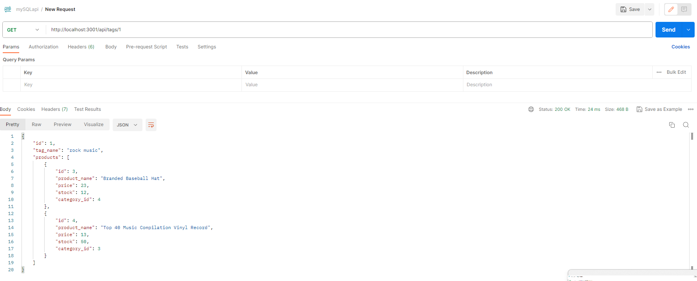

### Check out this app's demonstration video here: https://drive.google.com/file/d/1LzK1LctUPiOb95TgEFrpWCDrldf8oBv_/view

---

  

---

# mySQLapi

## Description




This is an Express.js application with Sequelize for managing products, categories, and tags. It uses MySQL for database and api platform such as Insomnia/Postman for testing api endpoints. It also uses dotenv for environment variables. It can be used to create, read, update, and delete products, categories, and tags. It also has a seed file to seed the database with sample data.


---

## Table of Contents

- [Installation](#installation)
- [Usage](#usage)
- [Endpoint](#endpoint)
- [Credits](#credits)
- [License](#license)
- [Contributing](#contributing)
- [Questions](#questions)

---

## Installation

You can simply download/clone the app from its repo to install.

To clone, run the following command in your terminal:

```
   git clone https://github.com/jyoungjoon/mySQLapi.git
```

To download: Simply click on the download button on the repository on browser and extract.

---

## Usage

After installation, you first need to create your database by running the following code in your mysql client:

```
   source db/schema.sql
```

Then, you need to seed the database with sample data by running the following code in your terminal:

```
   npm run seed
```

Then, you need to install all the dependencies by running the following code in your terminal:

```
   npm install
```

Then, you need to start the server by running the following code in your terminal:

```
   npm start
```

Then, you can use Insomnia or any other api platform (Postman, etc.) to test api endpoints. See 'routes' folder for complete api endpoints.

---

## Endpoint

### Example

#### Get All Products

- **Route:** `/api/products`
- **Method:** `GET`

**Example Request:**

```
GET localhost:3001/api/products
```

**Example Response:**

```
[
  {
    "id": 1,
    "product_name": "Product 1",
    "price": 19.99,
    "stock": 10,
    "createdAt": "2023-09-01T12:00:00.000Z",
    "updatedAt": "2023-09-01T12:00:00.000Z"
  },
  {
    "id": 2,
    "product_name": "Product 2",
    "price": 29.99,
    "stock": 5,
    "createdAt": "2023-09-01T13:00:00.000Z",
    "updatedAt": "2023-09-01T13:00:00.000Z"
  }
]
```

---

## License

This project is licensed under the MIT license.

---

## Credits

Thank you 2023 UC Berkeley Coding Bootcamp for providing its starter code.

---

## Contributing

Please email me for contributing instructions.

---

## Questions

Please email me or find me on Github for any questions or issues.

Find me on Github: [jyoungjoon](https://github.com/jyoungjoon)

You can also contact me at lifescriptified@gmail.com.

---
